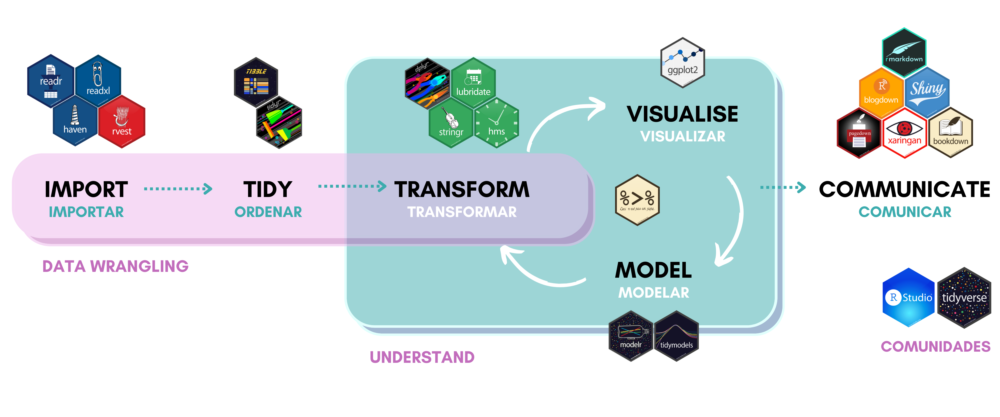
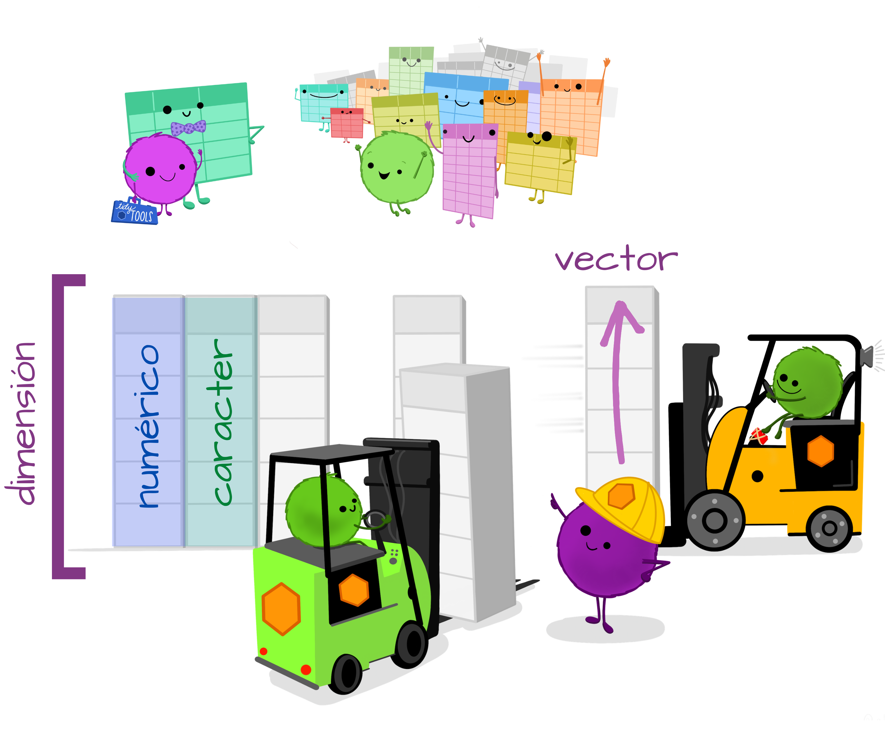
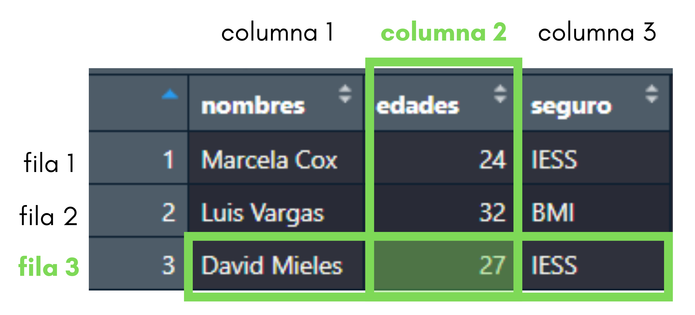
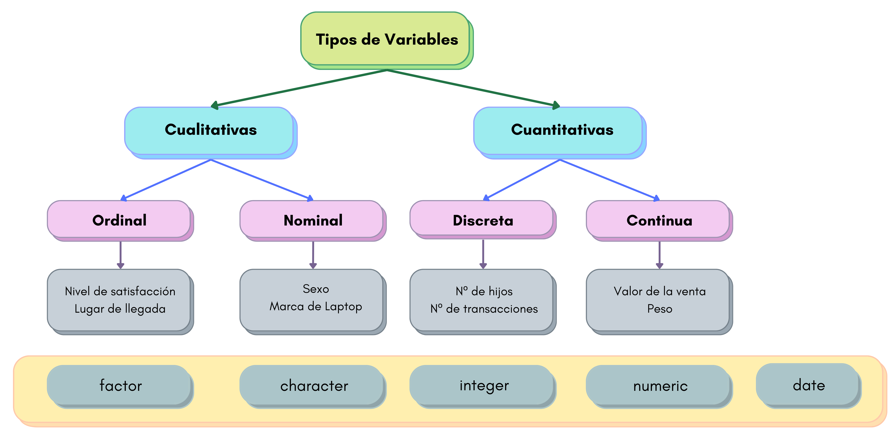

```{r configuracion, include = FALSE}
library(knitr)
library(tidyverse)
library(fontawesome)       #viñetas
library(xaringanExtra)
# set default options
opts_chunk$set(echo=FALSE,
               warning=FALSE,
               collapse = TRUE,
               dpi = 200)
knit_engines$set("yaml", "markdown")

xaringanExtra::use_tile_view()
xaringanExtra::use_clipboard()
xaringanExtra::use_share_again()
xaringanExtra::style_share_again(
  share_buttons = c("twitter", "linkedin", "pocket")
)
```

class: center, middle, titular
background-size: contain


# `r rmarkdown::metadata$title` 
## **`r rmarkdown::metadata$subtitle`**
#### `r rmarkdown::metadata$author`
#### `r rmarkdown::metadata$date`

---

class: middle, center

`r fontawesome::fa("r-project", height = "3em")`
# **IMPORTACIÓN Y ORDEN DE LOS DATOS EN R**
## CAPÍTULO 2

---

```{r xaringan-panelset, echo=FALSE}
xaringanExtra::use_panelset()
```

# `r fontawesome::fa("box-open")` Contenido del Capítulo 2

.pull-left[
* Calidad de los datos

* Importar datos
   * Importar archivos `.csv`
   * Importar desde Excel
   * Importar desde SPSS y STATA

* Práctica 2.1

* Estructuras de datos
   * Vectores
]

.pull-right[ 
* Estructuras de datos
   * Data.frames (Tibbles)
   * Funciones básicas
   
* Tipos de datos
   * Numéricos
   * Cadena de caracteres
   * Factores
   * Fechas y Horas

* Práctica 2.2
]

---

class: middle, center, inverse

`r fontawesome::fa("database", height = "3em")`
# Calidad de los datos

---

```{r datos1, echo=FALSE, out.width='50%', fig.align='center'}
knitr::include_graphics("img/lifecycle.png")
```

.footnote[ [Understanding the Data Science Lifecycle](https://www.sudeep.co/data-science/2018/02/09/Understanding-the-Data-Science-Lifecycle.html) || [8 Ways to Improve Decision Making](https://www.anblicks.com/blog/8-ways-to-improve-decision-making-and-cut-cost-with-better-data-quality)]

---

# `r fontawesome::fa("gears")` Proceso del *tidyverse*

```{r flujo , echo=FALSE, out.width='100%', fig.align='center'}

```

---

# `r fontawesome::fa("box-open")` Paquetes a utilizar

.pull-left[

* `r fontawesome::fa("check-double")` library(tidyverse)

   * `r fontawesome::fa("check")` `library(readr)`

   * `r fontawesome::fa("check")` `library(tibble)`

   * `r fontawesome::fa("check")` `library(stringr)`

   * `r fontawesome::fa("check")` `library(forcats)`

]

.pull-right[

* `r fontawesome::fa("check-double")` library(readxl)

* `r fontawesome::fa("check-double")` library(haven)

* `r fontawesome::fa("check-double")` library(lubridate)

* `r fontawesome::fa("check-double")` library(hms)
]

---

class: middle, center, inverse

`r fontawesome::fa("file-import", height = "3em")`
# Importar datos


---

# `r fontawesome::fa("file-csv")` Importar archivos `.csv`

.pull-left[

.center[

]

`readr` lee datos rectangulares de archivos delimitados, como valores separados por comas (CSV) y valores separados por tabuladores (TSV).

]

--

.pull-right[

Para leer un archivo `.csv` la función a utilizar es `read_csv()` del paquete `readr` que es parte del `tidyverse`. Para cargar nuestro archivo:

```{r csv2, echo=TRUE, eval=FALSE, warning=TRUE}
library(readr)
players21 <- read_csv("Data/players_21.csv")
```

También lo podemos hacer con el sistema base de `r fontawesome::fa("r-project")`, aquí no necesitamos cargar ninguna librería. Para esto, nos ubicamos en la barra de herramientas `File -> Import Dataset -> From Text (readr)`.

]

.footnote[ [readr.tidyverse.org](https://readr.tidyverse.org/) ]


---

# `r fontawesome::fa("file-excel")` Importar desde Excel

.pull-left[

.center[

]

`readxl` facilita la transferencia de datos de Excel a R y está diseñado para trabajar con datos tabulares. Admite tanto el formato `.xls` heredado como el formato `.xlsx` moderno basado en `xml`.

]

--

.pull-right[

Para leer un archivo de Excel la función a utilizar es `read_excel()` del paquete `readxl` que es parte del `tidyverse`. Para cargar nuestro archivo:

```{r exc2, echo=TRUE, eval=FALSE}
library(readxl)
vuelos <- read_excel("data/VentasVuelos.xlsx", 
    sheet = "data", skip = 1)
```

```{r exc3, echo=FALSE, warning=FALSE, message=FALSE}
library(readxl)
ventasvuelos <- read_excel("data/VentasVuelos.xlsx", 
    sheet = "data", skip = 1)
```

También lo podemos hacer con el sistema base de `r fontawesome::fa("r-project")`, aquí no necesitamos cargar ninguna librería. Para esto, nos ubicamos en la barra de herramientas `File -> Import Dataset -> From Excel...`.

]

.footnote[ [readxl.tidyverse.org](https://readxl.tidyverse.org/) ]

---

# `r fontawesome::fa("file-excel")` Importar desde SPSS y STATA

.pull-left[

.center[

]

`haven` permite que R lea y escriba varios formatos de datos utilizados por otros paquetes estadísticos al envolver la fantástica biblioteca ReadStat C escrita por Evan Miller. `haven` es parte del `tidyverse`.

]

--

.pull-right[

.panelset[
.panel[.panel-name[SPSS]
## **SPSS**
Para leer un archivo de SPSS la función a utilizar es `read_sav()` del paquete `haven` que es parte del `tidyverse`. Para cargar nuestro archivo:

```{r hav1, echo=TRUE, eval=FALSE, warning=TRUE}
library(haven)
estres <- read_sav("data/estres.sav")
```
]

.panel[.panel-name[STATA]
## **STATA**
Para leer un archivo de STATA la función a utilizar es `read_dta()` del paquete `haven` que es parte del `tidyverse`. Para cargar nuestro archivo:

```{r hav2, echo=TRUE, eval=FALSE, warning=TRUE}
library(haven)
pasajeros <- read_dta("data/pasajeros.dta")
```
]
]
]

.footnote[ [haven.tidyverse.org](https://haven.tidyverse.org/) ]

<!--

# `r fontawesome::fa("battle-net")` Importar desde la web

.pull-left[

.center[

]

`rio` realiza importación y exportación optimizada de datos. Usa la extensión de archivo de un nombre de archivo para determinar qué tipo de archivo es. 

]

.pull-right[

En esta ocasión leeremos información disponible en la web del [Banco Central del Ecuador](https://www.bce.fin.ec/).

```{r rio1, echo=TRUE, eval=FALSE}
library(rio)
# Data del Banco Central del Ecuador

# Para guardar la url de descarga en una variable
urlData <- "https://contenido.bce.fin.ec/documentos/Estadisticas/SectorReal/CuentasProvinciales/Can2020.xlsm" 

# Para importar los datos de la url, escogemos la pestaña
# sheet: pestaña del documento
# skip: número de filas omitidas
# col_names: desea nombre de columnas sea la primera fila
dataBCE <- import(urlData, sheet = "VAB Cantonal", skip = 6, col_names = TRUE)

```
]

.footnote[ [github.com/leeper/rio](https://github.com/leeper/rio) ]


# `r fontawesome::fa("file")` Otros archivos

* **Excel:** Usando el paquete `openxlsx` con
`read.xlsx(xlsxFile , sheet , startRow , colNames , skipEmptyRows, rowNames)`

* `foreign` para cargar archivos de SAS, SPSS, Stata: SAS (`read.xport()`), SPSS (`read.spss()`), Stata (`read.dta()`).

* GIS sistemas de información geográfica con `rgal` y `raster`.

* `GoogleSpreadSheets` con googlesheets.

* `data.table` para manejar grandes volúmenes de datos. Existe un curso corto gratuito brindado por la Sociedad Ecuatoriana de Estadística que pueden visitar en el siguiente link: [https://www.youtube.com/Sociedad_Ecuatoriana_Estadistica](https://www.youtube.com/watch?v=s1QnGTk0x8U&list=PL2PpISw8vp_oJlVXpYYowclogCCLtEOfX).

-->

---

background-color: var(--azul-claro)
class: middle, center, inverse

`r fontawesome::fa("laptop-code", height = "3em")`
## PRÁCTICA 2.1

---

# `r fontawesome::fa("pen")` Práctica 2.1

### 1. Cargar el archivo `profesores.xlsx` y guardarlo en un objeto llamado `profesores`.

```{r prac21, echo=FALSE, eval=TRUE}
profesores <- read_excel("data/profesores.xlsx")
```

### 2. Cargar el archivo `BasePrograma.xlsx` y guardarlo en un objeto llamado `baseprograma`.

```{r prac22, echo=FALSE, eval=TRUE}
baseprograma <- read_excel("data/BasePrograma.xlsx")
```

---

class: middle, center, inverse

`r fontawesome::fa("object-group", height = "3em")`
# Estructuras de Datos


---

# `r fontawesome::fa("vector-square")` Vectores

.pull-left[
El tipo de dato fundamental en R es el vector. Un vector es una secuencia de elementos de datos todos del mismo tipo.

Creamos un vector de dimensión 1:

```{r vect, echo=TRUE}
x <- 4
is.vector(x)        #¿es vector?
```

Hay varias formas de crear vectores, pero una de las más comunes es el operador de concatenación `c()`. 
]

--

.pull-right[
A continuación creamos un vector de 4 elementos de tipo numérico:

```{r vect2, echo=TRUE}
y <- c(11, 13, 15, 20)
y                   #para imprimir vector
is.vector(y)
```

También podemos crear un vector de tipo caracter de 4 elementos:

```{r vect3, echo=TRUE}
z <- c("1", "5", "11", "14")
z
is.vector(z)
```
]

---

# `r fontawesome::fa("vector-square")` Vectores

.pull-left[
También podemos realizar operaciones entre vectores de la misma dimensión:

```{r vect5, echo=TRUE}
w <- c(2, 5, 6, 8)
w

y + 2*w - 3
```
]

--

.pull-right[

Para conocer la longitud de un vector usamos `length()`.

```{r vect7, echo=TRUE}
length(y)
```

]

---

# `r fontawesome::fa("vector-square")` Vectores

.pull-left[
Podemos llamar elementos específicos de un vector usando la **indexación**. Por ejemplo:

* `x[]` es una forma de llamar a un elemento específico de un vector.
* `x[1]` es el primer elemento.
* `x[3]` es el tercer elemento.
* `x[-3]` es un vector con todo menos el tercer elemento.
]

.pull-right[
Vamos a intentar indexar los vectores que tenemos:

```{r vect10, echo=TRUE}
# reviso los elementos que contiene el vector w
w     

# extraigo el segundo elemento del vector w
w[2]    

# imprimo el vector w, excepto su tercer elemento
w[-3]   
```
]

---

# `r fontawesome::fa("table")` Data.frames

.pull-left[
Un data frame es un conjunto de vectores que deben cumplir las siguientes propiedades:
* Las componentes son vectores
* Cada vector puede ser de un tipo de dato distinto
* Cada columna es una variable
* Las columnas tienen el mismo largo

Las filas se denominan observaciones y las columnas se las denomina variables.
]

.pull-right[
.center[

Artwork by @allison_horst
]
]

---

.pull-left[
## `r fontawesome::fa("table")` Crear un data.frame

Con la función `data.frame()`, que se conformará de la unión de 3 vectores creados previamente.

```{r df1, echo=TRUE}
nombres <- c("Marcela Cox", "Luis Vargas", "David Mieles")
edades <- c(24,32,27)
seguro <- factor(c("IESS", "BMI", "IESS"))

pacientes <- data.frame(nombres, edades, seguro)
pacientes
```

Ver objeto creado en el panel `Environment`.
]

--

.pull-right[
## `r fontawesome::fa("table")` Cambiar nombre de columnas

* Desde la creación del data.frame:

```{r df2, echo=TRUE}
pacientes2 <- data.frame(N1=nombres, N2=edades, seguro)
pacientes2
```

* En un data.frame existente con `names()`:

```{r df10, echo=TRUE}
names(pacientes2) <- c("Name", "Age", "Insurance")
pacientes2
```
]

---

.pull-left[
## `r fontawesome::fa("table")` Navegando por el data.frame

Supongamos que queremos extraer la edad de David Mieles. (indexación)

```{r df11, echo=TRUE}
pacientes[3,2]
```

.center[

]

]

.pull-right[
<br>
<br>

También podemos consultar a R por los valores de una columna entera de nuestro data set con el símbolo `$`.

```{r df12, echo=TRUE}
pacientes$nombres
```

Y aplicar una función a esa columna:

```{r df13, echo=TRUE}
mean(pacientes$edades)
```

]

.footnote[ [tibble.tidyverse.org](https://tibble.tidyverse.org/) ]

---

# `r fontawesome::fa("object-group")` Funciones básicas para explorar data.frames

.pull-left[
* **`dim():`** indica las dimensiones del data.frame o tibble, número de filas y columnas.

* **`str():`** muestra de forma compacta la estructura interna de un objeto R.

* **`colnames():`** muestra el nombre de las variables de un data.frame.

* **`head():`** muestra las 10 primeras obervaciones del conjunto de datos.

* **`tail():`** muestra las 4 últimas observaciones del conjunto de datos.
]

.pull-right[
* **`summary():`** produce resúmenes de resultados de varias variables. Los resultados dependen de la clase de datos.

* **`sum():`** devuelve la suma de todos los valores presentes en sus argumentos.

* **`min():`** devuelve el valor mínimo de un vector numérico.

* **`max():`** devuelve el valor máximo de un vector numérico.
]

---

# `r fontawesome::fa("object-group")` Funciones básicas para explorar data.frames

.panelset[
.panel[.panel-name[Encuestados]
¿Cuántas personas llenaron la encuesta de la situación actual del profesorado de alumnos con necesidades especiales educativas?

```{r fb1, echo=TRUE}
dim(profesores)
```
]

.panel[.panel-name[Encuesta]

¿Cuál es la estructura de la encuesta de la situación actual del profesorado de alumnos con necesidades especiales educativas?

```{r fb2, echo=TRUE}
str(profesores)
```
]

.panel[.panel-name[Variables]

¿Cuáles son las variables de la encuesta de la situación actual del profesorado de alumnos con necesidades especiales educativas?

```{r fb3, echo=TRUE}
colnames(profesores)
```
]

.panel[.panel-name[Observaciones1]

Visualización de las primeras 5 encuestas realizadas al profesorado sobre la situación actual de alumnos con necesidades especiales educativas

```{r fb4, echo=TRUE}
head(profesores, n=5)
```
]

.panel[.panel-name[Observaciones2]

Visualización de las últimas 5 encuestas realizadas al profesorado sobre la situación actual de alumnos con necesidades especiales educativas

```{r fb5, echo=TRUE}
tail(profesores, n=5)
```
]

]

---

# `r fontawesome::fa("object-group")` Funciones básicas para explorar data.frames

.panelset[
.panel[.panel-name[Total]

¿Cuántos alumnos con necesidades especiales educativas constan en la encuesta?

```{r fb6, echo=TRUE}
sum(profesores$`No_Alumnos NEE`)
```
]

.panel[.panel-name[Min]

¿Cuál es la edad del profesor más joven que llenó la encuesta de la situación actual del profesorado de alumnos con necesidades especiales educativas?

```{r fb7, echo=TRUE}
min(profesores$Edad)
```
]

.panel[.panel-name[Max]

¿Cuál es la edad del profesor mayor que llenó la encuesta de la situación actual del profesorado de alumnos con necesidades especiales educativas?

```{r fb8, echo=TRUE}
max(profesores$Edad)
```
]

.panel[.panel-name[Resumen]
Genere un resumen de la variable `No_Alumnos` de la encuesta de la situación actual del profesorado de alumnos con necesidades especiales educativas.

```{r fb9, echo=TRUE}
summary(profesores$No_Alumnos)
```
]

]

---

class: middle, center, inverse

`r fontawesome::fa("keyboard", height = "3em")`
# Tipos de Datos

---

```{r tip1, echo=FALSE, out.width='100%', fig.align='center', fig.cap="Figura 2. Tipos de datos en R"}

```

---

## **Numéricos**

.pull-left[
Para determinar el tipo de dato de un data set aplicamos la función `class()`.

```{r tp1, echo=TRUE}
# clase de un vector de 1 elemento
class(5)

# clase de la columna edades del dataset pacientes
class(pacientes$edades)
```

Ahora, el vector $z$ de tipo caracter lo convertiremos en tipo numérico.

```{r tp2, echo=TRUE}
z
class(z)
```
]

--

.pull-right[
### Con `as.numeric()`.

```{r tp3, echo=TRUE}
# cambio de clase caracter a numérico con as.numeric()
class(as.numeric(z))
```

### Con `parse_number()`.

```{r tp4, echo=TRUE}
library(readr)
# cambio de clase caracter a numérico con parse_number()
class(parse_number(z))
```

]

<!--

## **Numéricos**

.pull-left[
**`parse_number()`** es muy útil para resolver problemas de decimales, caracteres que acompañas a números y caracteres de agrupación.

En R, por default, el decimal es el punto; `grouping_mark` para especificar el signo de agrupación; `decimal_mark` para especificar el decimal a cambiar.

```{r tp5, echo=TRUE}
parse_number("6'789,56", 
             locale = locale(grouping_mark = "'",
                             decimal_mark = ","))
```

]

.pull-right[
También sirve para extraer números insertos en texto.

```{r tp6, echo=TRUE}
parse_number("$100")

parse_number("20%")

parse_number("It cost $123.45")

parse_number("$123.456.789", locale = locale(grouping_mark = "."))
```

]
-->

---

## **Cadena de Caracteres**

.pull-left[
`readr` asume que tus datos están codificados en UTF-8. 

`charToRaw():` realiza una representación subyacente de una cadena de texto.

```{r cc5, echo=TRUE}
charToRaw("Linda")
```

¿Qué sucede cuando tus datos producidos no entienden UTF-8? 

```{r cc6, echo=TRUE}
library(readr)
x1 <- "El Ni\xf1o was particularly bad this year"
```

]

--

.pull-right[

Para corregir el problema necesitas especificar la codificación en **`parse_character()`**:

```{r cc7, echo=TRUE}
parse_character(x1, locale = locale(encoding = "Latin1"))
```

¿Cómo encontrar la codificación correcta? Con `guess_encoding()`

```{r cc8, echo=TRUE}
guess_encoding(charToRaw(x1))
```

]

.footnote[ [Tablas de codificación de caracteres](http://www.atc.uniovi.es/tablas.php)]

---

## **Cadena de Caracteres**

.pull-left[

.center[

]

`stringr` proporciona un conjunto cohesivo de funciones diseñadas para trabajar de forma más fácil con cadenas de caracteres.

```{r cc1, echo=TRUE}
library(stringr)
```

]

--

.pull-right[

```{r cc2, echo=TRUE}
frase <- "Esta es una cadena de caracteres"
class(frase)
```

`str_length()` indica el número de caracteres de una cadena.

```{r cc3, echo=TRUE}
str_length(frase)
```

`str_c()` combina dos o más cadenas:

```{r cc4, echo=TRUE}
str_c(frase, " y esto también")
```

]

.footnote[ [stringr.tidyverse.org](https://stringr.tidyverse.org/) || [tidyverse/reprex](https://github.com/tidyverse/reprex)]

---

## **Factores**

.pull-left[
.center[

]

`forcats` proporciona un conjunto de herramientas que resuelven problemas comunes con factores.

```{r fc1, echo=TRUE}
library(forcats)
```

]

--

.pull-right[
Imaginemos que tenemos la siguiente variable que registra meses:

```{r fc2, echo=TRUE}
fc1 <- c("Dic", "Abr", "Ene", "Mar")
class(fc1)
```

Si trabajamos esta variable en tipo caracter, tendremos 2 problemas:
1. Errores de tipeo,
2. No se ordena de una forma útil.

Estos problemas se solucionan trabajando con factores.
]

.footnote[ [forcats.tidyverse.org](https://forcats.tidyverse.org/) || [Wrangling categorical data in R](https://peerj.com/preprints/3163/) || [stringsAsFactors = <sigh>](https://notstatschat.tumblr.com/post/124987394001/stringsasfactors-sigh) ]

---

## **Factores**

Para crear un factor con **`factor()`** debes:

1. Definir una lista de niveles válidos.

```{r fc3, echo=TRUE}
niveles_meses <- c("Ene", "Feb", "Mar", "Abr", "May", "Jun", "Jul", "Ago", "Sep", "Oct", "Nov", "Dic")
```

2. Ahorar puedes crear un factor.

```{r fc4, echo=TRUE}
y1 <- factor(fc1, levels = niveles_meses)
class(y1)

# para acceder a los niveles del factor
levels(y1)
```


---

## **Fechas y Horas**

.pull-left[

**`parse_datetime()`** asume una fecha-hora ISO8601, estándar internacional en el que los componentes de una fecha están organizados de mayor a menor: año, mes, día, hora, minuto, segundo.

```{r fech1, echo=TRUE}
# Dato de fecha-hora
fecha1 <- "2010-10-01T2010"
parse_datetime(fecha1)

# Si se omite la hora, será determinada como medianoche.
fecha2 <- "20101010"
parse_datetime(fecha2)
```

]

--

.pull-right[

**`parse_date()`** asume aaaa-mm-dd o aaaa/mm/dd.

```{r fech2, echo=TRUE}
fecha3 <- "2010-10-01"
parse_date(fecha3)
```

**`parse_time()`** espera la hh:mm:ss, los segundos y el especificador am/pm son opcionales.

```{r fech3, echo=TRUE}
library(hms)
parse_time("01:10 am")
parse_time("20:10:01")
```
]

.footnote[ [ISO 8601](https://en.wikipedia.org/wiki/ISO_8601) || [hms.tidyverse.org](https://hms.tidyverse.org/)]

---

## **Fechas y Horas**

.pull-left[
.center[

]

`lubridate` hace que sea más fácil hacer las cosas que hace R con fecha y hora y hace posible hacer las cosas que R base no hace.

```{r fh1, echo=TRUE, warning=FALSE, message=FALSE}
library(lubridate)
```

]

--

.pull-right[
Hay tres tipos de datos de fechas/horas que se refieren a un instante en el tiempo:

* Una fecha o `date`.
* Una hora o `time` dentro de un día.
* Una fecha-hora o date-time `dttm` (llamado también `POSIXct`).

Para obtener la fecha o fecha-hora actual utiliza `today()` o `now()`:

```{r fh2, echo=TRUE}
today()
now()
```
]

.footnote[ [lubridate.tidyverse.org](https://lubridate.tidyverse.org/) || [hms.tidyverse.org](https://hms.tidyverse.org/) ]

---

## **Fechas y Horas**

.pull-left[

Hay tres modos en los que puedes crear una fecha/hora:

* Desde una cadena de caracteres (o string, en inglés).
* Desde componentes de fecha-hora individuales.
* Desde un objeto fecha-hora existente.

### Desde cadenas de caracteres

```{r fh3, echo=TRUE}
ymd("2017-01-31")
ymd("20170131")
```
]

--

.pull-right[

```{r fh4, echo=TRUE}
mdy("01-31-2017")
mdy("01312017")

dmy("31-01-2017")
dmy("31012017")

mdy_hm("01/31/2017 08:01")
ymd_hms("2017-01-31 20:11:59")
```

]

---

## **Fechas y Horas**

.pull-left[
### Desde componentes individuales

Crearé un data.frame donde las fechas y las horas están repartidos en diferentes columnas.

```{r fh5, echo=TRUE}
ejemplo <- data.frame(anio= c(1994, 1992, 1987),
                      dia= c(21, 02, 15),
                      mes= c(02, 04, 05),
                      hora= c(20, 14, 09),
                      minuto= c(45, 30, 15))
ejemplo
```

]

.pull-right[
`make_date()` para crear fecha.

```{r fh6, echo=TRUE}
# forma fecha que contiene dia, mes y anio
make_date(ejemplo$anio, ejemplo$mes, ejemplo$dia)
```

`make_datetime()` para crear fecha-hora.

```{r fh7, echo=TRUE}
# forma fecha-hora
make_datetime(ejemplo$anio, ejemplo$mes, ejemplo$dia, ejemplo$hora, ejemplo$minuto)
```

]

---

## **Fechas y Horas**


### Desde otros tipos

```{r fh8, echo=TRUE}
as_datetime(today())

as_date(now())
```

---

background-color: var(--azul-claro)
class: middle, center, inverse

`r fontawesome::fa("laptop-code", height = "3em")`
## PRÁCTICA 2.2
## PRÁCTICA 2.3

---

# `r fontawesome::fa("pen")` Práctica 2.2

### 1. Verifique la estructura del data set `profesores` y define el tipo de cada variable.

### 2. Prepare el data set para el análisis verificando que el tipo de dato de cada variable sea el adecuado, corríjalos.

### 3. Guarde el data set en un archivo excel en su computadora llamado `r_profesores`.

### 4. Extraer la información del 6to encuestado.

### 5. Extraer la siguiente información del 5to encuestado: edad, género y si condera que la atención a la diversidad es necesaria.

---

# `r fontawesome::fa("pen")` Práctica 2.3

### 1. Verifique la estructura del data set `baseprograma` y define el tipo de cada variable.

### 2. Prepare el data set para el análisis verificando que el tipo de dato de cada variable sea el adecuado, corríjalos.

### 3. Guarde el data set coregido en un archivo excel en su computadora `r_programa`.

### 4. Extraer la información del 5to encuestado.

### 5. Extraer la estatura y edad del 9no encuestado.

---

class: middle, center, inverse

<br>
<br>

# **¡FIN!**
## Importación y Orden de los Datos en R

### Síguenos

.pull-left[
.center[
### [@socecuest `r fontawesome::fa("facebook")`](https://www.facebook.com/socecuest)

### [@see_estadistica `r fontawesome::fa("instagram")`](https://www.instagram.com/see_estadistica/)
]]

.pull-right[
.center[
### [@see_estadistica `r fontawesome::fa("twitter")`](https://twitter.com/see_estadistica)

### [@sosecuest `r fontawesome::fa("telegram")`](https://t.me/sosecuest)
]]

