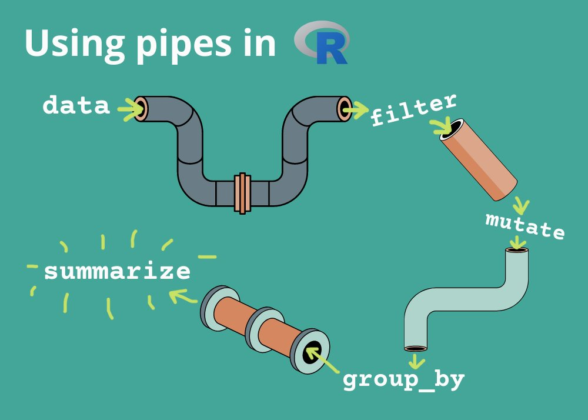
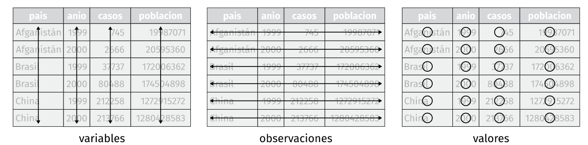
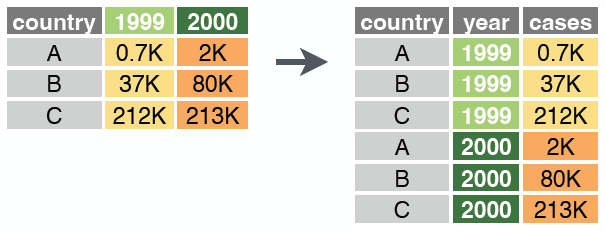
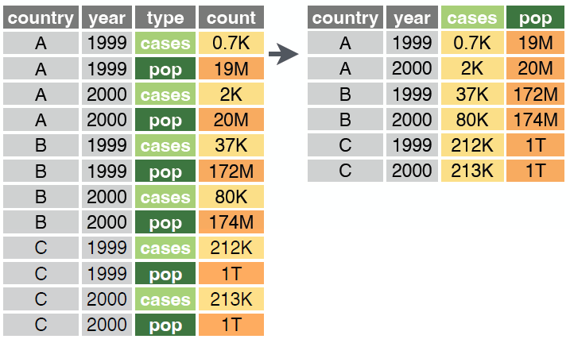

```{r configuracion, include = FALSE}
library(knitr)
library(tidyverse)
library(fontawesome)       #viñetas
library(xaringanExtra)
library(readxl)
# set default options
opts_chunk$set(echo=FALSE,
               warning=FALSE,
               collapse = TRUE,
               dpi = 200)
knit_engines$set("yaml", "markdown")

xaringanExtra::use_tile_view()
xaringanExtra::use_clipboard()
xaringanExtra::use_share_again()
xaringanExtra::style_share_again(
  share_buttons = c("twitter", "linkedin", "pocket")
)

profesores2 <- read_excel("data/r_profesores.xlsx")

library(dplyr)
library(kableExtra)

```

class: center, middle, titular
background-size: contain


# `r rmarkdown::metadata$title` 
## **`r rmarkdown::metadata$subtitle`**
#### `r rmarkdown::metadata$author`
#### `r rmarkdown::metadata$date`

---

class: middle, center

`r fontawesome::fa("r-project", height = "3em")`
# **MANIPULACIÓN DE DATOS EN R**
## CAPÍTULO 3

---

```{r xaringan-panelset, echo=FALSE}
xaringanExtra::use_panelset()
```

# `r fontawesome::fa("box-open")` Contenido del Capítulo 3

- Transformación de datos con `dplyr`
   * Modificar el nombre de las variables
   * Seleccionar o descartar variables
   * Operador pipe `%>%`
   * Filtrar observaciones
   * Agregar o editar variables
   * Resumir información
   * Agrupar o segmentar datos

- Práctica 3.1

- Datos ordenados con `tidyr`
   * Ordenar datos a lo largo
   * Ordenar datos a lo ancho

---

# `r fontawesome::fa("box-open")` Paquetes a utilizar

.pull-left[

* `r fontawesome::fa("check-double")` library(tidyverse)

   * `r fontawesome::fa("check")` `library(dplyr)`

   * `r fontawesome::fa("check")` `library(tidyr)`

]

.pull-right[

* `r fontawesome::fa("check-double")` library(magrittr)

* `r fontawesome::fa("check-double")` library(datos)

]

---

class: middle, center, inverse


# Transformación de datos con `dplyr`

---

# `r fontawesome::fa("wrench")` Funciones del paquete `dplyr`

<br>
<br>

| Función        |  Acción                                    |
|:---------------|-------------------------------------------:|
| `rename()`     | *Modifica el nombre de las variables* |
| `select()`     | *Selecciona o descarta variables (columnas) de un conjunto de datos* |
| `filter()`     | *Filtra las observaciones (filas) de interés* |
| `mutate()`     | *Agrega o edita variables (columnas)* |
| `summarise()`  | *Resume los datos en tablas* |
| `group_by()`   | *Agrupa o segmenta los datos en función de una variable (columna)* |

<br>

.footnote[ [dplyr.tidyverse.org](https://dplyr.tidyverse.org/) ]

---

# `r fontawesome::fa("wrench")` Modificar el nombre de las variables

.pull-left[
**`rename()`** se utiliza para cambiar el nombre de las variables. La función tiene el siguiente esquema:

```{r fdp2, echo=TRUE, eval=FALSE}
rename(data, columnas... )
```

Cambiando el nombre de las variables:

```{r fdp3, echo=TRUE, eval=TRUE}
colnames(profesores2)
```

]

.pull-right[
```{r fdp4, echo=TRUE, eval=TRUE}
profesores2 <- rename(profesores2, fecha= Fecha, 
                      edad=Edad, sexo=Genero, 
                      niveldocencia= Nivel_docencia,
                      tiempo=Tiempo_impartiendo_docencia,
                      alumnos=No_Alumnos,
                      alumnosNEE=`No_Alumnos NEE`,
                      necesaria=AD_es_necesaria,
                      asignatura=AD_en_cualquier_asignatura,
                      leyes=Leyes_para_ANEE,
                      ratio=Ratio_de_ANEE,
                      asistente=Asistente_de_clases,
                      instruccion=Suficiente_instruccion,
                      material=Material_utilizado)

colnames(profesores2)
```
]

---

# `r fontawesome::fa("wrench")` Seleccionar o descartar variables

.pull-left[
**`select()`** permite seleccionar rápidamente un subconjunto útil utilizando operaciones basadas en los nombres de las variables. La función tiene el siguiente esquema:

```{r fdp5, echo=TRUE, eval=FALSE}
select(data, columnas... )
```

## Ejercicio Práctico

- **Indicador 1:** Número promedio de estudiantes

- **Indicador 2:** Indicador 1 por sexo y nivel de educación
]

.pull-right[


### Variables de trabajo

* Sexo = `sexo`

* Edad del encuestado = `edad`

* Número de alumnos por profesor = `alumnos`

* Nivel de docencia = `niveldocencia`

]

---

# `r fontawesome::fa("wrench")` Seleccionar o descartar variables

Selecciono las variables que deseo del conjunto de datos:

```{r fdp6, echo=TRUE, eval=TRUE}
indicador_1a <- select(profesores2, sexo, edad, alumnos, niveldocencia)

colnames(indicador_1a)
```

Otra forma de seleccionar variables:

```{r fdp7, echo=TRUE, eval=TRUE}
indicador_1a <- select(profesores2, 2, 3, 4, 6)

colnames(indicador_1a)
```

---

# `r fontawesome::fa("code")` Operador `pipe` %>%

.pull-left[

.center[

]

`magrittr` ofrece un conjunto de operadores que hacen que su código sea más legible.

```{r op1, echo=TRUE, eval=TRUE, warning=TRUE, message=FALSE}
library(magrittr)
```

]

--

.pull-right[

* Estructura secuencias de operaciones de datos de izquierda a derecha (a diferencia de desde adentro hacia afuera).

* Minimiza la necesidad de variables locales y definiciones de funciones, y

* Facilita la adición de pasos en cualquier lugar de la secuencia de operaciones.

Puede utilizar el atajo de teclado `Ctrl+Shift+M` para generar el operador `%>%`.
]

.footnote[ [magrittr.tidyverse.org](https://magrittr.tidyverse.org/) ]


---

# `r fontawesome::fa("code")` Operador `pipe` %>%

.pull-left[
<br>
<br>
<br>
<br>
```{r op2, echo=TRUE, eval=FALSE}
dataset %>% 
    funcion1() %>% 
    funcion2() %>%
    funcion3()
```
]

--

.pull-right[


]

---

# `r fontawesome::fa("code")` Operador `pipe` %>%

```{r op3, echo = FALSE, out.width=700, fig.align='center'}

```

---

# `r fontawesome::fa("code")` Operador `pipe` %>%

.pull-left[
**Sin pipe**
```{r op4, echo=TRUE, eval=TRUE}
select(profesores2, sexo, edad, alumnos, niveldocencia)

```
]

.pull-right[
**Con pipe**
```{r op5, echo=TRUE, eval=TRUE}
profesores2 %>% select(sexo, edad, alumnos, niveldocencia)

```
]


---

background-image: url("img/dplyr_filter.jpg")
background-size: contain

---

# `r fontawesome::fa("wrench")` Filtrar observaciones

Para resolver el indicador planteado, vamos a delimitar el universo a las personas de 40 o más años por lo que usaremos **`filter()`**. 

```{r fdp8, echo=TRUE, eval=TRUE}
profesores2 %>% 
    select(sexo, edad, alumnos, niveldocencia) %>% 
    filter(edad >= 40)
```

---

# `r fontawesome::fa("wrench")` Filtrar observaciones

Por si deseas combinar condiciones aquí tienes una lista de operadores de comparación y operadores lógicos:

.pull-left[

| Condición     |  Acción    |
|:--------:|:--------------|
| == | igual |
| %in% | incluye |
| != | diferente |
| > | mayor que |
| >= | mayor o igual que |
| < | menor que |
| <= | menor o igual que |

]

.pull-right[
| Operador     |  Acción    |
|:--------:|:--------------|
| & | y - Cuando se cumplen ambas condiciones |
| &#124; | o - Cuando se cumple una u otra condición |
]

---

# `r fontawesome::fa("wrench")` Filtrar observaciones

Vamos a delimitar nuestros datos a la población femenina que no tiene estudiantes con NEE, mostrando solo las variables de edad, alumnos, nivel que imparte docencia y material utilizado.

```{r fdp9, echo=TRUE, eval=TRUE}
profesores2 %>% 
    filter(sexo=="Femenino" & alumnosNEE==0) %>% 
    select(edad, alumnos, niveldocencia, material)
```

---

# `r fontawesome::fa("wrench")` Filtrar observaciones

Vamos a delimitar nuestros datos a la población masculina que tiene 30, 31 y 32 años de edad, mostrando solo las variables de edad, alumnos, nivel que imparte docencia y material utilizado.

```{r fdp10, echo=TRUE, eval=TRUE}
profesores2 %>% 
    filter(sexo=="Masculino" & (edad %in% c(30,31,32))) %>% 
    select(edad, alumnos, niveldocencia, material)
```

---

background-image: url("img/dplyr_mutate.png")
background-size: contain

---

# `r fontawesome::fa("wrench")` Agregar o editar variables

Vamos a delimitar nuestros datos a la población masculina que tiene 30, 31 y 32 años de edad. Con **`mutate()`** agregaremos una columna que contenga el número de estudiantes que no tienen NEE. Mostrar las primeras 7 columnas y la última.

```{r fdp11, echo=TRUE, eval=TRUE}
profesores2 %>% 
    mutate(sinNEE=alumnos-alumnosNEE) %>% 
    filter(sexo=="Masculino" & (edad %in% c(30,31,32))) %>% 
    select(c(1:7, sinNEE, 14))
```

---

# `r fontawesome::fa("wrench")` Resumir información

**`summarise()`** se encarga de colapsar un data frame en una sola fila. Es mucho más útil si lo enlazamos con `group_by()`.

**Indicador 1:** Número promedio de estudiantes

```{r fdp12, echo=TRUE, eval=TRUE}
profesores2 %>% 
    summarise(EstudiantesPromedio = sum(alumnos)/n())
```

---

# `r fontawesome::fa("wrench")` Resumir información

**Indicador 3:** Número de profesores encuestados

**Indicador 4:** Edad promedio de profesores encuestados

**Indicador 5:** Número de estudiantes con NEE

```{r fdp13, echo=TRUE, eval=TRUE}
profesores2 %>% 
    summarise(TotalProfesores = n(),
              EdadPromedioProfesores = mean(edad),
              EstudiantesNEE = sum(alumnosNEE))
```

---

# `r fontawesome::fa("wrench")` Agrupar o segmentar datos


**`group_by()`** realiza operaciones en grupos definidos por variables que por sí sola no dará ningún resultado, por lo que debe ir seguido de la función `summarise()` con una acción apropiada para realizar.

- **Indicador 2:** Número promedio de estudiantes por sexo y nivel de educación

```{r fdp14, echo=TRUE, eval=TRUE}
profesores2 %>% 
    group_by(sexo, niveldocencia) %>% 
    summarise(EstudiantesPromedio = sum(alumnos)/n())
```

---

# `r fontawesome::fa("wrench")` Agrupar o segmentar datos

- **Indicador 6:** Indicador 3, 4 y 5 por sexo y nivel de educación

```{r fdp15, echo=TRUE, eval=TRUE}
profesores2 %>% 
    group_by(niveldocencia, sexo) %>% 
    summarise(TotalProfesores = n(),
              EdadPromedioProfesores = mean(edad),
              EstudiantesNEE = sum(alumnosNEE))
```

---

background-color: var(--azul-claro)
class: middle, center, inverse

`r fontawesome::fa("laptop-code", height = "3em")`
## PRÁCTICA 3.1

---

# `r fontawesome::fa("pen")` Práctica 3.1


1. Construir la siguiente tabla.

```{r fdp16, echo=FALSE, eval=TRUE}
kable(profesores2 %>% 
    group_by(niveldocencia) %>% 
    summarise(Profesores = n(),
              Estudiantes = sum(alumnos),
              'Estudiantes Promedio' = round(Estudiantes/Profesores),
              'Edad Promedio' = round(mean(edad)))%>% 
    rename("Nivel que imparte docencia"=niveldocencia))
```

---

class: middle, center, inverse


# Datos ordenados con `tidyr`

---

# `r fontawesome::fa("broom")` Datos ordenados

Existen tres reglas interrelacionadas que hacen que un conjunto de datos sea ordenado:

* Cada variable debe tener su propia columna.
* Cada observación debe tener su propia fila.
* Cada valor debe tener su propia celda.

```{r do1, echo = FALSE, out.width=1000, fig.align='center', fig.cap="Figura: Reglas que hacen que un conjunto de datos sea ordenado"}

```

---

# `r fontawesome::fa("broom")` Funciones del paquete `tidyr`

<br>
<br>
<br>

| Función        |  Acción                                    |
|:---------------|-------------------------------------------:|
| `pivot_longer()`     | *Modifica el nombre de las variables* |
| `pivot_wider()`     | *Selecciona o descarta variables (columnas) de un conjunto de datos* |

<br>
<br>
<br>
<br>

.footnote[ [tidyr.tidyverse.org](https://tidyr.tidyverse.org/) ]

---

# `r fontawesome::fa("broom")` Ordenar datos a lo largo

<br>

.pull-left[
.center[

]
]

.pull-right[
**`pivot_longer()`** alarga datos al contraer varias columnas en dos. Los nombres de columna se mueven a una nueva columna de `names_to` y los valores a una nueva columna de `values_to`.

```{r do2, echo=TRUE, eval=FALSE}
pivot_longer(data, cols, 
             names_to = "name", 
             values_to = "value", 
             values_drop_na = FALSE)
```
]

---

# `r fontawesome::fa("broom")` Ordenar datos a lo largo

.pull-left[
```{r do4, echo=TRUE, eval=TRUE}
library(datos)

table4a

```
]

.pull-right[
```{r do5, echo=TRUE, eval=TRUE}

tabla4a %>%  pivot_longer(cols = c(`1999`, `2000`), 
               names_to = "anio", 
               values_to = "casos")
```
]

---

# `r fontawesome::fa("broom")` Ordenar datos a lo ancho

<br>

.pull-left[
.center[

]
]

.pull-right[
**`pivot_wider()`** es lo contrario de `pivot_longer()`, amplia los datos expandiendo dos columnas en varias. Una columna proporciona los nuevos nombres de columna, la otra los valores..

```{r do3, echo=TRUE, eval=FALSE}
pivot_wider(data, 
            names_from = "name",
            values_from = "value")
```
]

---

# `r fontawesome::fa("broom")` Ordenar datos a lo ancho

.pull-left[
```{r do6, echo=TRUE, eval=TRUE}

table2

```
]

.pull-right[
```{r do7, echo=TRUE, eval=TRUE}

tabla2 %>%  pivot_wider(names_from = tipo, 
                        values_from = cuenta)

```
]

---

class: middle, center, inverse

<br>
<br>

# **¡FIN!**
## Importación y Orden de los Datos en R

### Síguenos

.pull-left[
.center[
### [@socecuest `r fontawesome::fa("facebook")`](https://www.facebook.com/socecuest)

### [@see_estadistica `r fontawesome::fa("instagram")`](https://www.instagram.com/see_estadistica/)
]]

.pull-right[
.center[
### [@see_estadistica `r fontawesome::fa("twitter")`](https://twitter.com/see_estadistica)

### [@sosecuest `r fontawesome::fa("telegram")`](https://t.me/sosecuest)
]]

