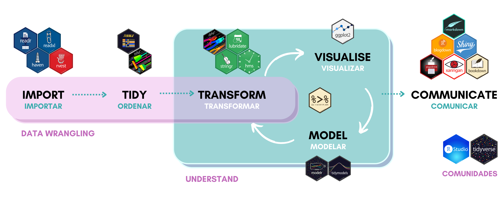

```{r configuracion, include = FALSE}
library(knitr)
library(tidyverse)
library(fontawesome)       #viñetas
library(xaringanExtra)
library(readxl)
# set default options
opts_chunk$set(echo=FALSE,
               warning=FALSE,
               collapse = TRUE,
               dpi = 200)
knit_engines$set("yaml", "markdown")

xaringanExtra::use_tile_view()
xaringanExtra::use_clipboard()
xaringanExtra::use_share_again()
xaringanExtra::style_share_again(
  share_buttons = c("twitter", "linkedin", "pocket")
)

profesores2 <- read_excel("data/r_profesores.xlsx")

library(ggplot2)
library(kableExtra)

```

class: center, middle, titular
background-size: contain


# `r rmarkdown::metadata$title` 
## **`r rmarkdown::metadata$subtitle`**
#### `r rmarkdown::metadata$author`
#### `r rmarkdown::metadata$date`

---

class: middle, center

`r fontawesome::fa("r-project", height = "3em")`
# **ANÁLISIS EXPLORATORIO DE DATOS**
## CAPÍTULO 4

---

```{r xaringan-panelset, echo=FALSE}
xaringanExtra::use_panelset()
```

# `r fontawesome::fa("box-open")` Contenido del Capítulo 4

- Creación de gráficos con `ggplot2`
   * ¿Qué es la visualización de datos?
   * Gramática de los gráficos
   * ggplot
   * Facetas
   


---

# `r fontawesome::fa("gears")` Proceso del *tidyverse*

```{r flujo , echo=FALSE, out.width='100%', fig.align='center'}

```

---

# `r fontawesome::fa("box-open")` Paquetes a utilizar

.pull-left[

* `r fontawesome::fa("check-double")` library(tidyverse)

   * `r fontawesome::fa("check")` `library(ggplot2)`

   * `r fontawesome::fa("check")` `library(tidyr)`

]

.pull-right[

* `r fontawesome::fa("check-double")` library(magrittr)

* `r fontawesome::fa("check-double")` library(datos)

]

---

class: middle, center, inverse


# Creación de gráficos con `ggplot2`

---

class: middle, center

# ¿Qué es la visualización de datos?

### La visualización de datos es una habilidad esencial para trabajar con datos, es una combinación de comprensión estadística y principios de diseño, así, la visualización de datos se trata de análisis de gráficos de datos y comunicación y percepción.

---

background-image: url("img/ggplot2_grammar.png")
background-size: contain

---

# `r fontawesome::fa("chart-line")` Gramática de los gráficos

- **Data:** datos sin procesar que desea trazar.
- **Geometrías `geom_:`** formas geométricas que representarán los datos.
- **Estética `aes()`:** estética de los objetos geométricos y estadísticos, como posición, color, tamaño, forma y transparencia.
- **Escalas `scale_`:** asignaciones entre los datos y las dimensiones estéticas, como el rango de datos para trazar el ancho o los valores de los factores para los colores.
- **Transformaciones estadísticas `stat_`:** resúmenes estadísticos de los datos, como cuantiles, curvas ajustadas y sumas.
- **Sistema de coordenadas `coord_`:** transformación utilizada para mapear coordenadas de datos en el plano del rectángulo de datos.
- **Facetas `facet_`:** disposición de los datos en una cuadrícula de gráficos.
- **Temas visuales `theme()`:** los valores predeterminados visuales generales de una trama, como el fondo, las cuadrículas, los ejes, el tipo de letra predeterminado, los tamaños y los colores.

---

# `r fontawesome::fa("chart-line")` ggplot

.pull-left[
## Data

Un **ggplot** necesita especificar mínimo tres cosas: los datos, la estética y una geometría. 

Siempre comenzamos a definir un objeto de trazado llamando a la **data** mediante `data %>% ggplot()` que simplemente le dice a `ggplot2` que vamos a trabajar con esos datos.
]

.pull-right[

.panelset[
.panel[.panel-name[Código]
Primero, cargamos el paquete `ggplot2` que es parte del `tidyverse`.

```{r graf1, echo=TRUE, eval=FALSE}
library(ggplot2)
```

```{r graf2, echo=TRUE, eval=FALSE}
profesores2 %>% ggplot()
```
]

.panel[.panel-name[Gráfico]
```{r graf3, echo=FALSE, eval=TRUE}
profesores2 %>% ggplot()
```
]]
]

---


# `r fontawesome::fa("chart-line")` ggplot

.pull-left[
## Estética

En la mayoría de los casos, es posible que desee trazar una o dos variables: una en el eje $x$ y otra en el eje $y$. Estas son estéticas posicionales y, por lo tanto, agregamos `aes(x = var1, y = var2)` a la llamada **ggplot()**.

Sin embargo, también hay casos en los que hay que especificar una o incluso tres o más variables.
]

.pull-right[

.panelset[
.panel[.panel-name[Código]
```{r graf4, echo=TRUE, eval=FALSE}
profesores2 %>% ggplot(aes(edad))
```
]

.panel[.panel-name[Gráfico]
```{r graf5, echo=FALSE, eval=TRUE}
profesores2 %>% ggplot(aes(edad))
```
]]
]

---

# `r fontawesome::fa("chart-line")` ggplot

.pull-left[
## Geometrías

Hay muchas geometrías diferentes (llamadas **geoms** porque cada función generalmente comienza con `geom_`) que se pueden agregar a un ggplot de forma predeterminada.

Tenemos que decirle a `ggplot2` qué estilo queremos usar, por ejemplo, agregando geom_bar() para crear un diagrama de barras.
]

.pull-right[

.panelset[
.panel[.panel-name[Código]
```{r graf6, echo=TRUE, eval=FALSE}
profesores2 %>% ggplot(aes(edad)) +
    geom_bar()
```
]

.panel[.panel-name[Gráfico]
```{r graf7, echo=FALSE, eval=TRUE}
profesores2 %>% ggplot(aes(edad)) +
    geom_bar()
```
]]
]

.footnote[
[Referencias de ggplot2](https://ggplot2.tidyverse.org/reference/) | [ggplot2.tidyverse.org](https://ggplot2.tidyverse.org/)
]

---

# `r fontawesome::fa("chart-line")` Facetas

Las facetas dividen un conjunto en subconjuntos basados en los valores de uno o más variables categóricas.

* **Facet** es un objeto que crea muchos gráficos pequeños que son variaciones de un solo gráfico. 

* Los datos se dividen en **grupos** (facetas) y los datos se trazan en sus propios gráficos usando el mismo sistema de coordenadas.

* Tenemos dos opciones al generar facetas:
   * Gráfico dividido según filas y columnas: `facet_grid()`
   * Envolver subconjuntos en columnas: `facet_wrap()` 

---

background-image: url("img/facet.png")
background-size: contain

---

.panelset[
.panel[.panel-name[facet_grid1]
.pull-left[
```{r fc1, echo=TRUE, eval=FALSE}
profesores2 %>% 
    ggplot(aes(edad)) +
    geom_bar() +
    facet_grid(.~niveldocencia)
```
]
.pull-right[
```{r fc2, echo=FALSE, eval=TRUE}
profesores2 %>% 
    ggplot(aes(edad)) +
    geom_bar() +
    facet_grid(.~niveldocencia)
```
]
]

.panel[.panel-name[facet_grid2]
.pull-left[
```{r fc3, echo=TRUE, eval=FALSE}
profesores2 %>% 
    ggplot(aes(edad)) +
    geom_bar() +
    facet_grid(niveldocencia~.)
```
]
.pull-right[
```{r fc4, echo=FALSE, eval=TRUE}
profesores2 %>% 
    ggplot(aes(edad)) +
    geom_bar() +
    facet_grid(niveldocencia~.)
```
]
]

.panel[.panel-name[facet_grid3]
.pull-left[
```{r fc5, echo=TRUE, eval=FALSE}
profesores2 %>% 
    ggplot(aes(edad)) +
    geom_bar() +
    facet_grid(niveldocencia~tiempo)
```
]
.pull-right[
```{r fc6, echo=FALSE, eval=TRUE}
profesores2 %>% 
    ggplot(aes(edad)) +
    geom_bar() +
    facet_grid(niveldocencia~tiempo)
```
]
]

.panel[.panel-name[facet_wrap]
.pull-left[
```{r fc7, echo=TRUE, eval=FALSE}
profesores2 %>% 
    ggplot(aes(edad)) +
    geom_bar() +
    facet_wrap(~niveldocencia)
```
]
.pull-right[
```{r fc8, echo=FALSE, eval=TRUE}
profesores2 %>% 
    ggplot(aes(edad)) +
    geom_bar() +
    facet_wrap(~niveldocencia)
```
]
]
]

---

# `r fontawesome::fa("chart-line")` Coordenadas y Escalas

## Coordenadas

Son conjuntos que ubican puntos en el espacio. Generalmente, vemos las coordenadas como esquemas para mapear elementos de conjuntos para objetos geométricos.

Las coordenadas más conocidas son las **coordenadas cartesianas**, donde el punto es ubicado en un plano cartesiano por su distancia a dos rectas que se cortan.

Hay diferentes **sistemas de coordenadas**. ¿Por qué usar diferentes sistemas? Una razón es simplificar la visualización de gráficos.

Las transformaciones de coordenadas pueden cambiar algunos gráficos curvilíneos a lineales. ggplot2 proporciona diferentes sistemas de coordenadas.

---

background-image: url("img/coordinate.png")
background-size: contain

---

# `r fontawesome::fa("chart-line")` Coordenadas y Escalas

## Escalas

Las **escalas** controlan los detalles de cómo los valores de los datos se traducen en propiedades visuales. Podemos anular las escalas predeterminadas para ajustar detalles como etiquetas de eje o claves de leyenda, o
usar una traducción completamente diferente de datos a estética.

En general, podemos usar escalas para:
   * modificar etiquetas de ejes, leyendas y gráficos,
   * escalas de uso general,
   * escalas de ubicación,
   * escalas de color y relleno,
   * escalas de forma,
   * escalas de tamaño, entre otras...

---

# `r fontawesome::fa("chart-line")` Coordenadas y Escalas

## Escalas

Uso con cualquier estética `aes()`:
   * alpha, color
   * fill
   * linetype
   * shape, size
   
**scale_\*_continous()** asigna valores continuos a valores visuales

**scale_\*_discrete()** asigna valores discretos a valores visuales


---

# `r fontawesome::fa("chart-line")` Temas visuales


---

background-color: var(--azul-claro)
class: middle, center, inverse

`r fontawesome::fa("laptop-code", height = "3em")`
## PRÁCTICA 3.1

---

# `r fontawesome::fa("pen")` Práctica 3.1


1. Construir la siguiente tabla.


---

# `r fontawesome::fa("chart-line")` Transformaciones estadísticas

**Stats** son métodos que alteran la posición de las geometrías. Podemos representar más de una estadística en una figura.

La capa de **Stats** representa una forma alternativa de crear una capa, ya que es una transformación del conjunto de datos original.

Con las estadísticas, creamos variables adicionales (transformadas) para mapear la estética.

Los métodos estadísticos más importantes disponibles para los gráficos se dividen en cinco clases:
   * **bin** (particiones y mallas - para histogramas)
   * **summary** (estadísticas básicas: media, mediana, desviación, …)
   * **region** (límites de intervalo y región)
   * **suave** (regresión, smoothing, interpolación y estimación de densidad)
   * **link** (métodos para calcular bordes de gráficos basados en un conjunto de nodos o puntos)

---

# `r fontawesome::fa("chart-line")` Transformaciones estadísticas

Hay docenas de capas de **Stats** especificadas con un `stat_function`.

Las variables calculadas (de la capa de **Stats**) se pueden mapear usando el atributo `stat()`.

Algunas funciones de **Stats**:
   * `stat_ecdf()`: calcula la distribución acumulativa empírica
   * `stat_ellipse()`: calcula elipses de confianza normales
   * `stat_identity()`: deja los datos como están
   * `stat_summary()` `stat_summary_bin()`: resume los valores $y$ en valores $x$ únicos/agrupados
   * `stat_summary_2d()` `stat_summary_hex()`: contenedor y resúmenes en 2D
   * `stat_unique()`: eliminar duplicados
   * `stat_sf_coordinates()`: extrae las coordenadas de los objetos `sf`
   * `stat()`: estética calculada

---


class: middle, center, inverse

<br>
<br>

# **¡FIN!**
## Importación y Orden de los Datos en R

### Síguenos

.pull-left[
.center[
### [@socecuest `r fontawesome::fa("facebook")`](https://www.facebook.com/socecuest)

### [@see_estadistica `r fontawesome::fa("instagram")`](https://www.instagram.com/see_estadistica/)
]]

.pull-right[
.center[
### [@see_estadistica `r fontawesome::fa("twitter")`](https://twitter.com/see_estadistica)

### [@sosecuest `r fontawesome::fa("telegram")`](https://t.me/sosecuest)
]]

