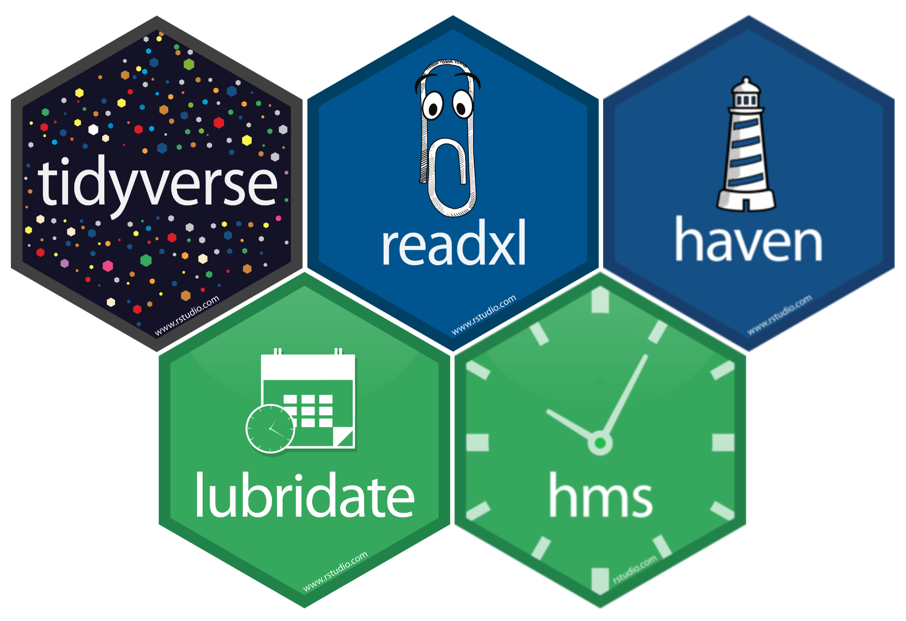

```{r configuracion, include = FALSE}
library(knitr)
library(tidyverse)
library(fontawesome)       #viñetas
library(xaringanExtra)
library(readxl)
# set default options
opts_chunk$set(echo=FALSE,
               warning=FALSE,
               collapse = TRUE,
               dpi = 200)
knit_engines$set("yaml", "markdown")

xaringanExtra::use_tile_view()
xaringanExtra::use_clipboard()
xaringanExtra::use_share_again()
xaringanExtra::style_share_again(
  share_buttons = c("twitter", "linkedin", "pocket")
)

profesores2 <- read_excel("data/r_profesores.xlsx")

library(ggplot2)
library(kableExtra)
library(datos)

```

class: center, middle, titular
background-size: contain


# `r rmarkdown::metadata$title` 
## **`r rmarkdown::metadata$subtitle`**
#### `r rmarkdown::metadata$author`
#### `r rmarkdown::metadata$date`

---

class: middle, center

`r fontawesome::fa("r-project", height = "3em")`
# **COMUNICANDO RESULTADOS CON R**
## CAPÍTULO 5

---

```{r xaringan-panelset, echo=FALSE}
xaringanExtra::use_panelset()
```

# `r fontawesome::fa("box-open")` Contenido del Capítulo 5

- `rmarkdown`
   * Instalación de `rmarkdown`
   * Primeros pasos
   * Encabezado YAML
   * Formateo de texto
   * Fragmentos de código R
   * Tablas
   * Gráficos
   * Formatos
- Más formatos `rmarkdown`
   * Tipos de formatos
   * Presentaciones, Libros y más...
- GitHub y RStudio

---

class: middle, center, inverse


# `rmarkdown`

---

# `r fontawesome::fa("markdown")` Instalación de `rmarkdown`


Aquí aprenderemos sobre el paquete `rmarkdown`, el cual es una herramienta para integrar texto, código y resultados. Puedes usarlo en modo notebook, es decir, en un entorno interactivo de ejecución de código para la comunicación de resultados de estudios o análisis científicos y para divulgación científica. 

Con `rmarkdown` se pueden obtener una gran variedad de salidas que puedes generar usando la librería, incluyendo dashboards (tableros de control), sitios web, y libros.

Para que `rmarkdown` funcione debes tener instalados los siguientes paquetes:

```{r paq, echo=TRUE, eval=FALSE}
install.packages("tinytex", dependencies = TRUE)
install.packages("knitr", dependencies = TRUE)
install.packages('rmarkdown')
```

<br>

.footnote[[https://www.rstudio.com/resources/cheatsheets/](https://www.rstudio.com/resources/cheatsheets/)]

---

# `r fontawesome::fa("markdown")` Primeros pasos

.pull-left[
Para crear un archivo Rmarkdown debes ir a `File -> New File -> Rmarkdown...`, aquí te aparecerá una ventana donde deberás indicar el nombre del archivo que deseas crear y por el momento elegiremos `html`, y creamos con OK.

Contiene tres tipos importantes de contenido:

1. Un encabezado YAML rodeado de ---

2. Bloques de código de R rodeados de `````.

3. Texto mezclado con formateos de texto simple como **negritas** e _itálicas_.
]

.pull-right[
```{r rmar, echo=FALSE, out.width='100%', fig.align='center'}

```
]

---

# `r fontawesome::fa("markdown")` Primeros pasos

```{r rmar1, echo=FALSE, out.width='100%', fig.align='center'}

```

---

# `r fontawesome::fa("markdown")` Encabezado YAML

**YAML** es la sigla en inglés de la frase *“yet another markup language”*, que significa *“otro lenguaje de marcado más”*. Este lenguaje de marcado está diseñado para representar datos jerárquicos de modo tal que sea fácil de escribir y leer para humanos. 

R Markdown lo utiliza para controlar muchos detalles del output. Este encabezado determina los parámetros generales de formato para el documento a compilar. 

En lenguaje computacional se entiende como los metadatos del documento; esto es, información que define el formato del archivo resultante, más no su contenido:

- **Título (title).** Texto entre comillas que servirá de título general del documento.

- **Subtítulo (subtitle).** Texto entre comillas que servirá de subtítulo general del documento.

- **Autor (author).** Texto entre comillas para indicar el nombre del o los autores.

- **Resumen (Abstract).** Texto entre comillas para indicar el resumen del documento.

---

# `r fontawesome::fa("markdown")` Encabezado YAML

- **Fecha (date).** Campo para indicar la fecha. En el texto, con la expresión *today*, se solicita que imprima la fecha actual según el calendario del sistema operativo.

- **Formato de bibliografía (csl).** Nombre de un archivo de extensión .csl para indicar el formato de referencias en el cuerpo del texto y el listado de bibliografía al final del documento.

Los argumentos dentro del apartado resultado (`output`) son los siguientes:

- **pdf_document:** indica el formato preestablecido para compilar el documento. En este caso, se trata de un PDF. Puede ser *html_document* o *word_document*.

- **number_sections:** si está definido como yes define que se numerarán los títulos y sutítulos a lo largo del documento, de manera automática y correlativa.

- **toc:** es la abreviación de table of contents.

- **toc_float:** indica si desea un índice flotante.

---

# `r fontawesome::fa("markdown")` Encabezado YAML

## Opciones LaTeX

Muchos aspectos de la plantilla LaTeX utilizada para crear documentos PDF se pueden personalizar utilizando metadatos YAML de nivel superior (tenga en cuenta que estas opciones no aparecen debajo de la sección de salida, sino que aparecen en el nivel superior junto con el título, el autor, etc.) . Por ejemplo:

* **fontsize:**	Tamaña de la fuente (10pt, 11pt, or 12pt).

* **documentclass:**	Clases de documentos de LaTeX (article, book, etc.)

* **linkcolor, urlcolor, citecolor:**	Colores para links externos, internos y citas.

Puedes ver todas las opciones para personalizar la salida LaTex (pdf) en [https://www.rstudio.com/wp-content/uploads/2015/03/rmarkdown-reference.pdf](https://www.rstudio.com/wp-content/uploads/2015/03/rmarkdown-reference.pdf).


---

# `r fontawesome::fa("markdown")`  Encabezado YAML

### Ejercicio 5.1

1. En esta primera parte vamos a crear el siguiente [documento](https://rpubs.com/lindajazmin1987/practica-capitulo5) `.html` publicable. Crear un archivo R Markdown vacío con el nombre "resumen_modulo". Note que cuando crea el archivo la extensión de este archivo es `.Rmd`.

2. Crea el encabezado YAML con los siguientes datos.

```{r yaml1, echo=TRUE, eval=FALSE}
---
title: "Resumen del módulo de Manejo de Software"
subtitle: "Programa Internacional de Estadística Aplicada  a la Investigación Científica"
author: "Linda Cabrera"
date: "2022-10-17"
output: 
  html_document:
    toc: TRUE               # incluye o no el indice
    toc_float: TRUE         # incluye o no indice flotante
    theme: "flatly"         # especifica el tema Bootstrap
    highlight: textmate     # resaltado de sintaxis
    number_sections: TRUE   # enumerar las secciones
---
```


---

# `r fontawesome::fa("markdown")` Formateo de texto


Existe una hoja de referencia útil que la obtienes en la ruta `Help > Markdown Quick Reference`.

.pull-left[
## Encabezados o Títulos

Para escribir un encabezado o título en un documento debes hacerlo con el signo numeral \# de la siguiente manera:

```{r titulo1, echo=TRUE, eval=TRUE}
# Título 1
## Subtítulo 1.1
## Subtítulo 1.2
### Subsubtítulo 1.2.1

# Título 2

# Título 3
```
]

.pull-right[

### Ejercicio 5.2

```{r titulo2, echo=TRUE, eval=FALSE}
# Profesoras

Gabriela Castro Centeno y Linda Cabrera Orellana son las profesoras que impartieron el módulo.

## Gabriela Castro
### Sociedad Ecuatoriana de Estadística
#### Directora Ejecutiva

## Linda Cabrera
### R-Ladies Guayaquil
#### Co-organizadora
```

]


---

# `r fontawesome::fa("markdown")` Formateo de texto

.pull-left[
## Listas

```{r lista1, echo=TRUE, eval=FALSE}
1. Item 1
2. Item 2
    1. Item 2a
    2. Item 2b
```

```{r lista2, echo=TRUE, eval=FALSE}
- Item 1
- Item 2
    + Item 2a
    + Item 2b
```

]
    
.pull-left[
### Ejercicio 5.3

```{r lista3, echo=TRUE, eval=FALSE}
# Contenido del módulo

El módulo inició el lunes 3 de octubre de 2022 y finalizará el jueves 20 de octubre de 2022, abarcó los siguientes temas:

1. Introducción a R
7. Introducción a R Commander
3. Introducción a SPSS
4. RStudio
    1. Introducción a RStudio
    2. Importación y orden de los datos en R
    7. Manipulación de datos en R
    6. Análisis exploratorio de datos
    5. Comunicando resultados con R
```

]

---

# `r fontawesome::fa("markdown")` Formateo de texto

### Ejercicio 5.4

```{r lista4, echo=TRUE, eval=FALSE}
El módulo tiene una duración de 25 horas y en cada capítulo de Rstudio se profundizaron temas relevantes para el contenido del Programa Internacional de Estadística Aplicada  a la Investigación Científica. Por ejemplo en el capítulo de Importación y orden de los datos en R se revisaron los siguientes temas:

- Calidad de los datos
- Importar datos
   * Importar archivos `.csv`
   * Importar desde Excel
   * Importar desde SPSS y STATA
- Estructuras de datos
   * Vectores
   * Data.frames (Tibbles)
   * Funciones básicas
- Tipos de datos
   * Numéricos
   * Cadena de caracteres
   * Factores
   * Fechas y Horas
```


---

# `r fontawesome::fa("markdown")` Formateo de texto

## Citas

Para escribir citas puedes utilizar el paquete `tufte`:

> "Comprender las cosas que nos rodean es la mejor preparación para comprender las cosas que hay mas allá."
> `r tufte::quote_footer('--- Hipatia')`

### Ejercicio 5.5

```{r cita, echo=TRUE, eval=FALSE}
# RStudio

En la introducción de la parte de RStudio recordamos una frase de Hadley Wickhman para recordar que aprender R es aprender un nuevo idioma por lo que necesita práctica y paciencia:

> "Cuando comienzas a programar, es fácil sentirte realmente frustrado... Es solo una parte natural de la programación, le sucede a todos y se vuelve cada vez menos con el tiempo. No te culpes. Solo tómate un descanso, haz algo divertido y luego regresa e inténtalo de nuevo más tarde."
> `r tufte::quote_footer('Hadley Wickham')`
```


---

# `r fontawesome::fa("markdown")` Formateo de texto

## Links

Para incluir un link que al hacer clic te direccione a una dirección http, debes escribir el texto entre corchetes y seguido el link entre paréntesis.

```{r link1, echo=TRUE, eval=FALSE}
[link de Rstudio](https://www.rstudio.com/)
```

### Ejercicio 5.6

```{r link2, echo=TRUE, eval=FALSE}
## Introducción a RStudio

1. Descargamos RStudio en el siguiente [link](https://www.rstudio.com/products/rstudio/download/)

2. Instalamos RStudio en nuestras computadoras

3. Conocimos el entorno de RStudio

4. Aprendimos a instalar y cargar paquetes
```


---

# `r fontawesome::fa("markdown")` Formateo de texto

.pull-left[
## Expresiones Matemáticas 

Expresión matemática encerrada en un signo de dólar, la escribe en la misma línea `$x^2+5$` y queda así $x^2+5$, mientras si está encerrada en dos signos de dólar, la escribe en la siguiente línea y centrada: $$x^2+5$$

Puedes encontrar más fórmulas en el siguiente [link1](http://metodos.fam.cie.uva.es/~latex/apuntes/apuntes3.pdf) y [link2](https://aprender-uib.github.io/AprendeR2/extras-de-r-markdown.html#f%C3%B3rmulas-matem%C3%A1ticas).
]

.pull-right[
### Ejercicio 5.7

```{r mate1, echo=TRUE, eval=FALSE}
5. Es posible usar R como una calculadora, donde podemos hacer operaciones desde muy sencillas a muy complicadas. Por ejemplo puedo calcular sin problema: $$\sqrt{23^3+10}-\dfrac{2}{3}+ \ln(1) - e^3$$

6. Aprendimos a crear objetos mediante asignaciones <- cuyo atajo de teclado es Alt+-.

7. Aprendimos qué es una función en R y que nos ahorran cálculos en nuestro análisis. R tiene funciones para casi todo lo que deseemos hacer en nuestros trabajos. Por ejemplo, para calcular la integral de una función puedo utilizar la función integrate(), en lugar de hacer el cálculo matemático paso a paso. Vamos a realizar el cálculo de una integral definida de forma analítica y a través de R:

Ejercicio: Calcular ${\displaystyle \int_{1}^{3} (x^2 + 4) \, dx}$

Recordemos el Teorema Fundamental del Cálculo:
```

]

---

# `r fontawesome::fa("markdown")` Formateo de texto

### Ejercicio 5.7

```{r mate2, echo=TRUE, eval=FALSE}
Teorema
Sea ${\displaystyle f}$ una función integrable en el intervalo ${\displaystyle [a,b]}$ y ${\displaystyle f=g'}$ para alguna función ${\displaystyle g}$ entonces:

$${\displaystyle \int_{a}^{b} f(x) \, dx = g(b) - g(a)}$$
Resolvemos la integral definida:

$$
\left.\begin{array}{lcl}
{\displaystyle \int_{1}^{3} (x^2 + 4) \, dx} & = & \left| \dfrac{x^3}{3} + 4x \right|_{1}^{3}\\
 & = & \left( \dfrac{3^3}{3} + 4(3) \right) - \left( \dfrac{1^3}{3} + 4(1) \right)\\
 & = & 9 + 12 - \frac{1}{3} - 4\\
 & = & 17 - \frac{1}{3} = \frac{50}{3} = 16.67
\end{array}\right.
$$

Ahora utilizamos la función integrate() en R para calcular la misma integral. Si consultamos `?integrate` en la consola podemos observar que necesitamos 3 argumentos que son la función function(x), el límite inferior lower y el límite superior upper:

integrate(function(x) (x^2 + 4), lower =1, upper = 3)

El material de este capítulo se encuentra en [Introducción a RStudio](https://lindajzmin.github.io/r-research/intro_rstudio.html)
```

---

# `r fontawesome::fa("markdown")` Formateo de texto

## Énfasis

Puedes hacer las cosas en **negrita** usando dos asteriscos, como esto: `**negrita**`, hacer cosas en *cursiva* usando guiones bajos, como esto: `_italicas_` o escribir ~~tachado~~, como esto: `~~tachado~~`. También puedes escribir código en línea utilizando <code>&#96;</code>.


## Imágenes

Puedes incluir un archivo de imagen usando este código: ``

### Ejercicio 5.8

```{r imagen1, echo=TRUE, eval=FALSE}
## Importación y orden de los datos en R


En este capítulo necesitamos instalar algunos paquetes:


```


---

# `r fontawesome::fa("markdown")` Formateo de texto

### Ejercicio 5.8

```{r imagen2, echo=TRUE, eval=FALSE}
<br>

- Imagen con tamaño definido:


<br>

- Imagen centrada con tamaño definido y caption:

<p align="right">

<div align="right">Paquetes instalados en el capítulo 2 del Módulo</div>
 
</p>
    
El material de este capítulo se encuentra en [Importación y Orden de los Datos en R](https://lindajzmin.github.io/r-research/datos_en_r.html)
```


---

# `r fontawesome::fa("markdown")` Formateo de texto

## Incluir bibliografía

Para que la bibliografía conecte, deberás crear un archivo tipo BibTeX Database (.bib) donde especificarás los datos del o de los artículo/s o libro/s.

En el encabezado YAML del documento debes agregar las opciones `bibliography: biblio.bib` donde debes especificar el nombre del archivo .bib que debe estar en el mismo directorio que estás trabajando y `csl: apa.csl` donde especificas el formato de la bibliografía, en este caso he utilizado el formato apa, puedes encontrar más estilos de bibliografía en [https://github.com/citation-style-language/styles](https://github.com/citation-style-language/styles).

### Ejercicio 5.9

```{r biblio, echo=TRUE, eval=FALSE}
## Manipulación de datos en R

Este capítulo nos da una introducción práctica a los datos ordenados (o tidy data) y a las herramientas que provee el paquete `tidyr`, puedes leer más en *R para Ciencia de Datos* de @hadley2021. Si deseas aprender más acerca de la teoría subyacente, puede que te guste el artículo Tidy Data de @JSSv059i10 publicado en la revista Journal of Statistical Software, http://www.jstatsoft.org/v59/i10/paper.
```


---

# `r fontawesome::fa("markdown")` Fragmentos de código R

**Markdown** es interesante y útil, pero el poder real proviene de la mezcla entre **markdown** y fragmentos (chunks) de código **R**. Cuando se compila el documento, el código **R** se ejecutará; si producen figuras, las figuras se insertarán en el documento final.

Los chunks del código principal se ven así:

<pre>
&#96;&#96;&#96;{r load_data}
gapminder <- read.csv("~/Desktop/gapminder.csv")
&#96;&#96;&#96;
</pre>

Es decir, coloca un fragmento de código **R** entre <code>&#96;&#96;&#96;{r chunk_name}</code> y <code>&#96;&#96;&#96;</code>. Es una buena idea darle a cada fragmento un nombre, ya que te ayudarán a corregir los errores y, si algunos gráficos son producidos, los nombres de archivo estarán basados en el nombre del fragmento de código que los produjo.

---

# `r fontawesome::fa("markdown")` Fragmentos de código R

Hay una variedad de opciones quen afectan la forma en que los chunks de código son tratados:

- `echo=TRUE` o `echo=FALSE` muestra el código o no, respectivamente.
- `results="hide"` evita que se impriman los resultados.
- `eval=TRUE` o `eval=FALSE` evalua o no el código, respectivamente.
- `warning=FALSE` y `message=FALSE` oculta cualquier advertencia o mensajes producidos.

A menudo habrá opciones particulares que querrás usar
repetidamente; para esto, puede establecer las opciones de chunks _global_, de esta forma:

<pre>
&#96;&#96;&#96;{r global_options, echo=FALSE}
knitr::opts_chunk$set(fig.path="img/", message=FALSE, warning=FALSE, 
                      echo=FALSE, results="hide", fig.width=11)
&#96;&#96;&#96;
</pre>

La opción `fig.path` define dónde se guardarán las figuras. El `/` aquí es realmente importante; sin él, las figuras se guardarían en el lugar estándar, pero solo con los nombres que están con `Figs`.

---

# `r fontawesome::fa("markdown")` Fragmentos de código R

### Ejercicio 5.10

**Código NO se ve, SI se evalúa, NO se muestran resultados:** Incluye este chunk al inicio del texto, luego del encabezado YAML, con los siguientes argumentos <code>{r configuracion, echo=FALSE, eval=TRUE, include=FALSE}</code>:

```{r frag1, echo=TRUE, eval=FALSE}
library(knitr)
library(tidyverse)
library(readxl)
library(datos)
# configurar opciones por default
opts_chunk$set(echo=FALSE,
               warning=FALSE)
```

**Código SI se ve, SI se evalúa:** Incluye este chunk al final con los siguientes argumentos <code>{r trans1, echo=TRUE, eval=TRUE}</code>:

```{r frag2, echo=TRUE, eval=FALSE}
profesores <- read_excel("data/r_profesores.xlsx")
```


---

# `r fontawesome::fa("markdown")` Fragmentos de código R

### Ejercicio 5.10

**Código NO se ve, SI se evalúa:** Incluye este chunk con los siguientes argumentos <code>{r trans2, echo=FALSE, eval=TRUE}</code>:

```{r frag3, echo=TRUE, eval=FALSE}
profesores %>% 
    group_by(niveldocencia) %>% 
    summarise(Profesores = n(),
              Estudiantes = sum(alumnos),
              'Estudiantes Promedio' = round(Estudiantes/Profesores),
              'Edad Promedio' = round(mean(edad)))%>% 
    rename("Nivel que imparte docencia"=niveldocencia)
```

**Código SI se ve, NO se evalúa:** Incluye el mismo chunk anterior pero con los siguientes argumentos <code>{r trans3, echo=TRUE, eval=FALSE}</code>:

El paquete `knitr` provee casi 60 opciones que puedes usar para personalizar tus bloques de código. Puedes ver la lista completa en [Opciones de bloques](http://yihui.name/knitr/options/).

---

# `r fontawesome::fa("markdown")` Tablas

.pull-left[
Podemos incluir tablas de dos formas: creándolas o haciendo consultas de la data. Para crear una tabla, podemos formarla como sigue:

```{r tab1, echo=TRUE, eval=FALSE}
| Derecha | Izquierda | Default | Centro |
|--------:|:----------|---------|:------:|
| 12      | 12        | 12      | 12     |
| 123     | 123       | 123     | 123    |
| 1       | 1         | 1       | 1      |
```

| Derecha | Izquierda | Default | Centro |
|--------:|:----------|---------|:------:|
| 12      | 12        | 12      | 12     |
| 123     | 123       | 123     | 123    |
| 1       | 1         | 1       | 1      |
]

.pull-right[
### Ejercicio 5.11

Incluye una tabla del horario del módulo al final del contenido:

```{r tab2, echo=TRUE, eval=FALSE}
Horario del módulo:
    
| Hora     |  Contenido    |
|:--------:|:--------------|
| 19:00 a 19:45 | Bloque 1 |
| 19:45 a 20:50 | Receso 1 |
| 20:50 a 20:35 | Bloque 2 |
| 20:35 a 20:45 | Receso 2 |
| 20:45 a 21:30 | Bloque 3 |
```

]


---

# `r fontawesome::fa("markdown")` Tablas

### Ejercicio 5.11

Modifica la tabla del chunck `trans2` con *knitr::kable*:

```{r tab3, echo=TRUE, eval=FALSE}
knitr::kable(
    profesores %>%
        group_by(niveldocencia) %>% 
        summarise(Profesores = n(),
                  Estudiantes = sum(alumnos),
                  'Estudiantes Promedio' = round(Estudiantes/Profesores),
                  'Edad Promedio' = round(mean(edad)))%>%
        rename("Nivel que imparte docencia"=niveldocencia),
    caption = "Tabla 1. Resumen de indicadores"
)
```

Si desea darle un formato diferente a las tablas, puede ampliar el tema en el siguiente link [Package kable y kableExtra](https://rpubs.com/JeisonAlarcon/Tables-R)

---

# `r fontawesome::fa("markdown")` Gráficos

Una de las mejores cosas que puede hacer en `rmarkdown` es incluir el código de sus gráficos y que se generen directamente en R. Intenta agregando el último gráfico del capítulo anterior.


# `r fontawesome::fa("markdown")` Formatos

En el siguiente link puede encontrar varios formatos para todas las clases de documentos que genera `rmarkdown` [Formatos de R Markdown](https://rmarkdown.rstudio.com/formats.html).

---

class: middle, center, inverse

`r fontawesome::fa("markdown", height = "3em")`
# Más formatos `rmarkdown`

---

# Tipos de formatos

- **Salida `.html`:** La salida para este reporte es `output: html_document`. Los documentos pueden ser publicados en RPubs, GitHub, en un sitio web personal o Google drive. Debes crear una cuenta en RPubs [https://rpubs.com/users/new](https://rpubs.com/users/new). Haremos una prueba en RPubs con el documento 'resumen_modulo.Rmd'.

- **Salida `.docx`:** Para que se genere una salida de un archivo con extensión `.docx` el output en el encabezado YAML es `output: word_document`. Haremos una prueba en RPubs con el documento 'resumen_moduloWORD.Rmd'.

- **Salida `.pdf`:** La salida para este documento es `output: pdf_document`. Haremos una prueba en RPubs con el documento 'resumen_moduloPDF.Rmd'.


---

# Presentaciones, Libros y más...

- **LaTeX Beamer:** Salida por default es: `output: beamer_presentation:`. Probemos cargando el archivo 'prueba_beamer.Rmd'. Puedes encontrar más temas en [beamer-theme-matrix](https://hartwork.org/beamer-theme-matrix/).

- **Power Point:** Salida por default es: `output: powerpoint_presentation`. Probemos creando un archivo de nombre 'prueba_PPT.Rmd'.

- **Paquete `xaringan`:** nuevos estilos de presentaciones.

- **Paquete `bookdown`:** facilita la escritura de libros y artículos/informes de formato largo con R Markdown. Revisar [bookdown: Authoring Books and Technical Documents with R Markdown](https://bookdown.org/yihui/bookdown/). Obtener la plantillas en [github.bookdown](https://github.com/rstudio/bookdown).

- **Paquete `pagedown`:** plantillas de hojas de vida, tesis, artículo de la Journal of Statistical Software, entre otros.

- **Paquete `vitae`:** plantillas de hojas de vida.


---

class: middle, center, inverse

`r fontawesome::fa("github", height = "3em")`
# GitHub y RStudio

---

# `r fontawesome::fa("github")` Conectar RStudio y GitHub

Git es un sistema de control de versiones que le permite realizar un seguimiento de quién realizó cambios y cuándo, y tiene opciones para actualizar fácilmente una versión compartida o pública de su código en github.com.

## Para conectar con GitHub y RStudio

1. Crear una cuenta en [GitHub](https://github.com/).

2. Crear un token personal, las instrucciones se encuentran en [https://docs.github.com/en/authentication/keeping-your-account-and-data-secure/creating-a-personal-access-token](https://docs.github.com/en/authentication/keeping-your-account-and-data-secure/creating-a-personal-access-token)

3. * Descargar e instalar Git, los pasos a seguir están en [https://carpentries.github.io/workshop-template/#shell](https://carpentries.github.io/workshop-template/#shell).

---

# `r fontawesome::fa("github")` Conectar RStudio y GitHub

## Para conectar con GitHub y RStudio

* Luego ir a `Tools` y escoger la opción `Global Options...`, buscamos la pestaña `Git/SVN` y debemos asegurarnos de tener la dirección del ejecutable de Git.

* En caso de no conocer la ubicación del ejecutable de Git, podemos averiguarlo desde la Terminal con `$ which git.exe`.

* Puedo crear un nuevo proyecto o elegir uno existente, y luego automáticamente en el panel de environment aparecerá una pestaña que dice `Git` y un botón en la barra de herramientas que indica `Git`.

* Ver más en [https://swcarpentry.github.io/git-novice-es/14-supplemental-rstudio/index.html](https://swcarpentry.github.io/git-novice-es/14-supplemental-rstudio/index.html).


---

# `r fontawesome::fa("github")` Algunos sitios de interés

- [knitr in a knutshell](https://kbroman.org/knitr_knutshell/)

- [R Markdown documentation](https://rmarkdown.rstudio.com/)

- [Escribir un
Trabajo Fin de Estudios
con R Markdown](http://destio.us.es/calvo/memoriatfe/MemoriaTFE_PedroLuque_2017Nov_imprimir2caras.pdf)

- [“Utilizando	LaTeX en	RStudio](http://umh1480.edu.umh.es/wp-content/uploads/sites/44/2013/02/teim_sesion_001_latex_en_RStudio_16_17.pdf)

- [Chunk options and package options](https://yihui.org/knitr/options/)

- [R Markdown: The Definitive Guide](https://bookdown.org/yihui/rmarkdown/)

---


class: middle, center, inverse

<br>
<br>

# **¡FIN!**
## Comunicando resultados con R

### Síguenos

.pull-left[
.center[
### [@socecuest `r fontawesome::fa("facebook")`](https://www.facebook.com/socecuest)

### [@see_estadistica `r fontawesome::fa("instagram")`](https://www.instagram.com/see_estadistica/)
]]

.pull-right[
.center[
### [@see_estadistica `r fontawesome::fa("twitter")`](https://twitter.com/see_estadistica)

### [@sosecuest `r fontawesome::fa("telegram")`](https://t.me/sosecuest)
]]

