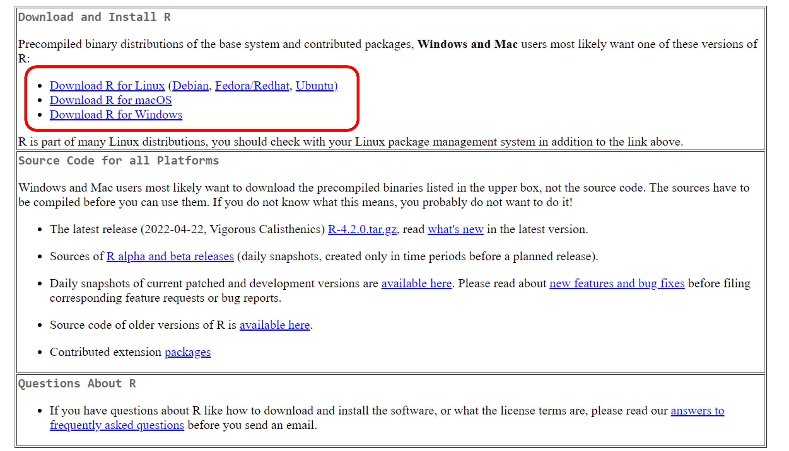
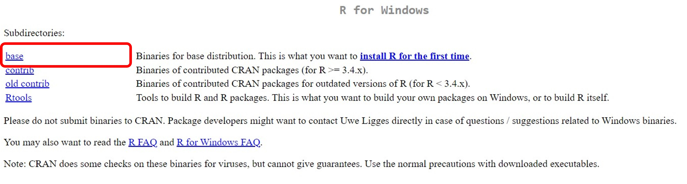
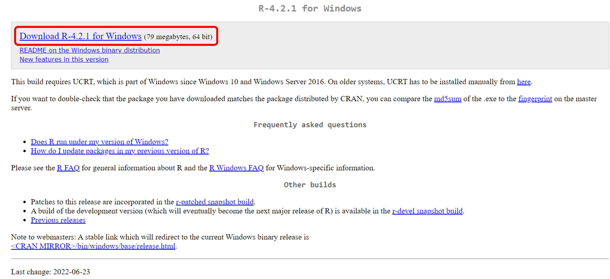
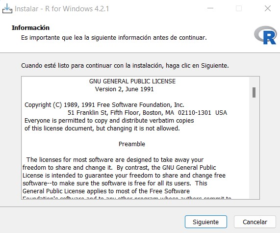
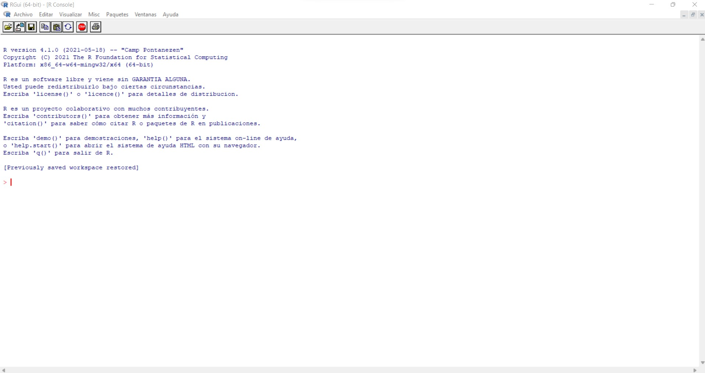
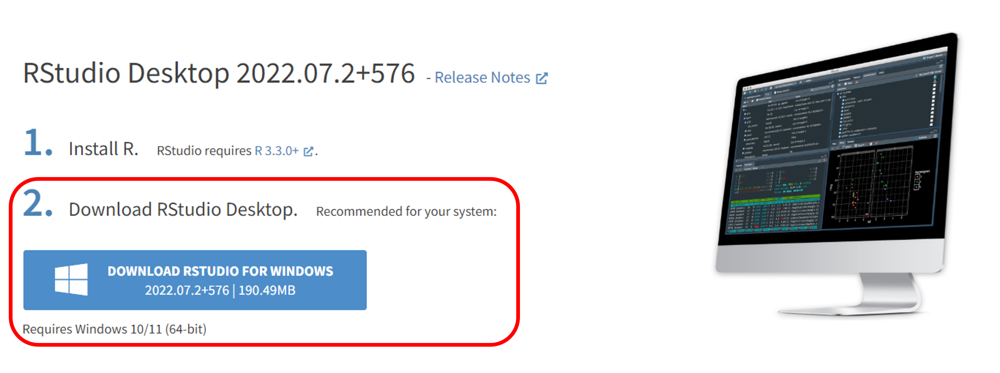
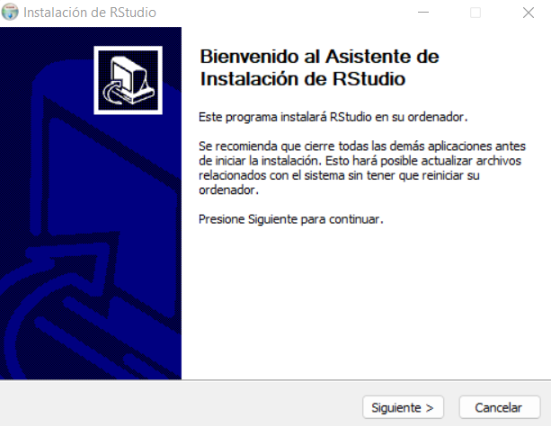
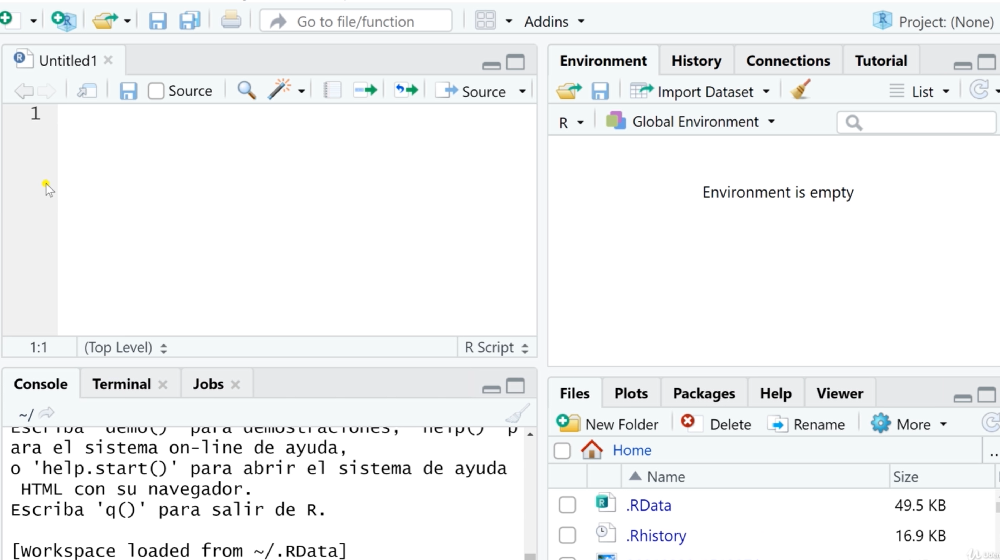

```{r setup, include=FALSE}
knitr::opts_chunk$set(echo = TRUE)
```

```{r See, echo=FALSE, out.width='20%', fig.align='center'}
knitr::include_graphics("img/see_azul.jpeg")
```

# Instalación de R

1. Para descargar R, ingresa a [CRAN](https://cran.rstudio.com/)[^5]. Aquí te aparecerá una pantalla (Figura 1) donde deberás elegir el sistema operativo de tu computadora.

```{r descargaR, echo=FALSE, out.width='100%', fig.align='center', fig.cap="Pantalla CRAN - RStudio"}

```

2. **Windows:** Si tu sistema operativo es `Windows`, en la siguiente pantalla que te aparece (Figura 2) elige la primera opción que indica `base`:

```{r windows1, echo=FALSE, out.width='100%', fig.align='center', fig.cap="Pantalla 1 para descarga instalador de R para Windows"}

```

3. **Windows:** Aquí te aparacerá una pantala donde deberás hacer clic para iniciar la descarga del instalador de la última versión de R para Windows (Figura 3).

```{r windows2, echo=FALSE, out.width='100%', fig.align='center', fig.cap="Pantalla 2 para descarga instalador de R para Windows"}

```

4. **Windows:** Cuando se haya terminado de descargar el instalador, abre el ejecutable, elige el idioma Español y sigue todos los pasos para su instalación dando clic en siguiente (Figura 4). Este proceso de instalación puede durar algunos minutos.

```{r installR, echo=FALSE, out.width='60%', fig.align='center', fig.cap="Pantalla de instalador de R para Windows"}

```

5. **macOS:** Si tu sistema operativo es `macOS`, elige la primera opción que indica `R-4.2.1.pkg` para iniciar la descarga del instalador, luego abre el ejecutable y sigue todos los pasos para la instalación.

6. Toda vez que se haya completado la instalación, para confirmar que se hizo correctamente nos dirigimos a las aplicaciones y hacemos clic en `Inicio -> Todas las aplicaciones -> R -> R X64 4.2.0` y se debe abrir la siguiente pantalla (Figura 5):

```{r consolaR, echo=FALSE, out.width='100%', fig.align='center', fig.cap="Consola RGui"}

```


# Instalación de RStudio

1. Con R instalado, ahora procederemos a descargar RStudio desde [https://www.rstudio.com/products/rstudio/download/](https://www.rstudio.com/products/rstudio/download/). El navegador identificará automáticamente el sistema operativo de tu computadora y te sugerirá la descarga del instalador más apropiado (Figura 6).

[^5]: CRAN es un acrónimo *Comprehensive R Archive Network* (Red integral de archivos R) para el lenguaje de programación R.

```{r rstudio, echo=FALSE, out.width='80%', fig.align='center', fig.cap="Pantalla de RStudio/products"}

```

2. Hacer clic en el ejecutable que se ha descargado e inicia la instalación siguiendo todos los pasos (Figura 7).

```{r rstudio2, echo=FALSE, out.width='60%', fig.align='center', fig.cap="Pantalla de instalación RStudio"}

```

3. Toda vez que se haya completado la instalación, para confirmar que se hizo correctamente nos dirigimos a las aplicaciones y hacemos clic en `RStudio` y se debe abrir la siguiente pantalla (Figura 8):

```{r rstudio3, echo=FALSE, out.width='100%', fig.align='center', fig.cap="Entorno de RStudio"}

```

**Nota:** Es necesario realizar la instalación en el orden aquí presentado, es decir instalar primero R y luego RStudio.